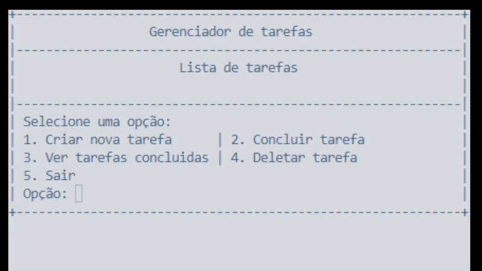

<h1 align='center'>To do List ✅</h1>
This project is a simple Task List application built in C# for task management. It allows the user to perform the following operations:

- Create tasks
- Complete tasks
- View completed tasks
- Delete tasks

The application uses list manipulation to store and manage tasks, ensuring control over the actions of adding, removing, and completing tasks.

## Features

- Create Task: Adds a new task to the pending task list.
- Complete Task: Moves a task from the pending list to the completed list.
- View Completed Tasks: Displays the tasks that have been completed.
- Delete Task: Removes a task from the pending or completed task lists.

## How to use

1. Clone the repsoitory:
   ```bash
   git clone https://github.com/arthurbonfim/ToDoList
   ```
2. Navigate to the project directory:
   ```bash
   cd ToDoList
   ```
3. Open the project in your preferred code editor (e.g., Visual Studio or Visual Studio Code).
4. Run the project. The application will be ready to use, and tasks will be managed through the methods of the TaskManager class.

## Technologies Used

- C#: Programming language used for the development of the application.
- .NET: Platform for running the code.

## License

This project is licensed under the MIT License. See the [LICENSE](../LICENSE) file for details.
